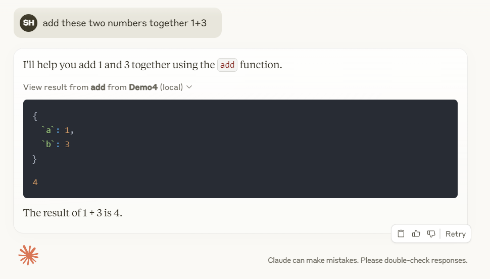
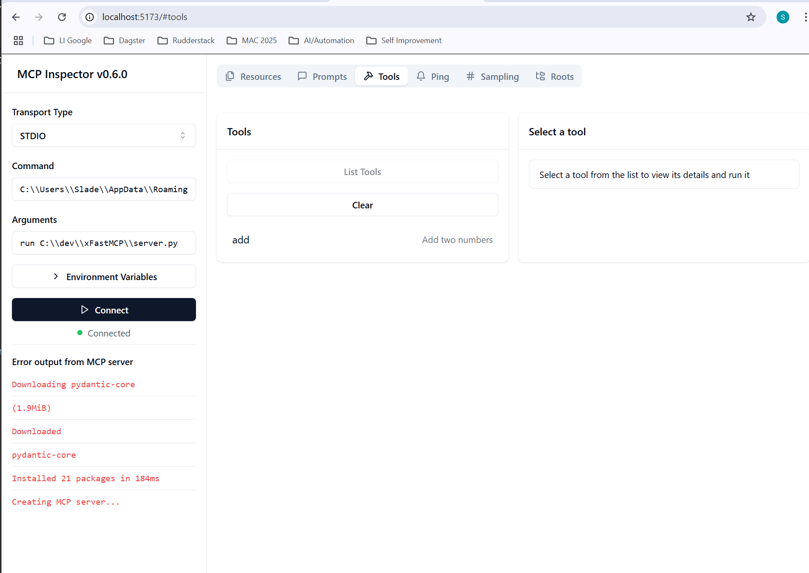

MCP playaround
https://modelcontextprotocol.io/quickstart/user
https://modelcontextprotocol.io/quickstart/server

pypi doco
https://pypi.org/project/mcp/


Create a config file for claude desktop.  File -> Settings, Developer tab, then click Edit Config.  This will create a config file call claude_desktop_config.json.
e.g. C:\Users\Slade\AppData\Roaming\Claude\claude_desktop_config.json


```
pip install mcp
```


Run so available in Claude desktop, this will create an entry in claude_desktop_config.json

```
mcp install server.py

C:\Users\Slade\AppData\Roaming\Python\Python310\Scripts\mcp.exe install server.py
```
or use this config file (for non uv)

```
{
  "mcpServers": {
    "filesystem": {
      "command": "npx",
      "args": [
        "-y",
        "@modelcontextprotocol/server-filesystem",
        "C:\\Users\\Slade\\Downloads"
      ]
    },
    "Demo4": {
      "command": "C:\\Users\\Slade\\AppData\\Roaming\\Python\\Python310\\Scripts\\mcp",
      "args": [
          "run",
          "C:\\dev\\xFastMCP\\server.py"
      ]
    }
  }
}
```

  


Run inspector
```
mcp dev server.py

C:\Users\Slade\AppData\Roaming\Python\Python310\Scripts\mcp.exe dev server.py
```

change LHS settings to match your working config from claude_desktop_config.json, e.g.

```
Command: C:\\Users\\Slade\\AppData\\Roaming\\Python\\Python310\\Scripts\\mcp
Arguments: run C:\\dev\\xFastMCP\\server.py

```


  